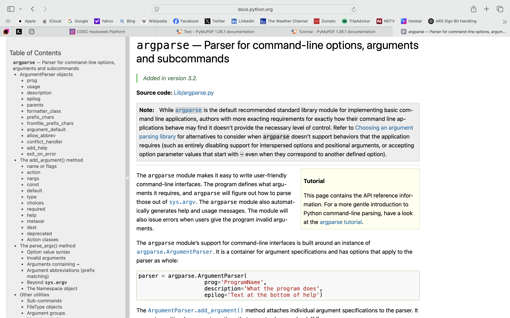

# CLI  tool to analyze resume.

## running/ using process.(How to use)

1. **Clone this repo**

2. **open in terminal / preferred IDLE**

3. **run the command**
    ``` bash
    pip install -r requirements.txt** 
   
    this installs the required dependencly/ package

   PyMuPDF 
    

   argparse 
   


4. then paste your resume in the root folder and rename to resume.pdf or your preferrable name.

5. then run as

    ``` python
     pip3 main.py resume.py

6. if not willing to paste the resume and rename to resume just give the absolute path of your resume.

    ``` python
    pip3 main.py (absolute path)
    
    pip3 main.py users/yourname/desktop/resume.pdf
    
7. this will give you the output.

8. also if you want to change the skills to be checeked then just modify the skills.json file.

